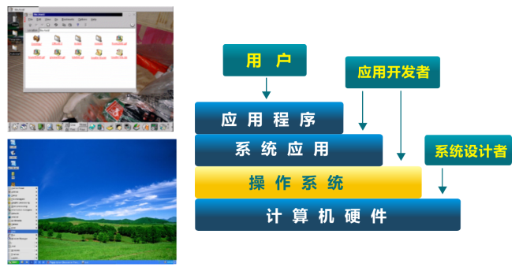

## 第一讲 操作系统概述
### 第二节 什么是操作系统

向勇 陈渝 李国良 任炬 

2024年春季

---

## 操作系统定义

没有公认的精确定义

  操作系统是**管理硬件资源**、控制程序运行、改善人机界面和**为应用软件提供支持**的一种系统**软件**。[计算机百科全书]

承上启下的操作系统

---

## 操作系统是一个资源管理程序
- 应用与硬件之间的**中间层**
- **管理**各种软硬件资源
- 访问软硬件资源的**服务**
- **解决访问冲突**, 确保公平使用

---

## 操作系统是一个控制程序
- 一个系统软件
- 执行程序, 给程序**提供服务**
- 控制程序执行过程, **防止错误**
- **方便用户使用**计算机系统

---

## 操作系统中的软件分类

- Shell – 命令行接口
- GUI – 图形用户接口
- Kernel – 操作系统的内部

---
## uCore/rCore 教学操作系统内核

---
## 操作系统内核的抽象

---
## 操作系统内核的抽象

---
## 操作系统内核的特征

- **并发**：计算机系统中同时存在多个运行程序
- **共享**：程序间“同时”访问互斥共享各种资源
- **虚拟**：每个程序” 独占” 一台完整的计算机
- **异步**：服务的完成时间不确定，也可能失败 

---
## 你对操作系统内核的理解

###  用户/应用对操作系统的需求？

---
## 你对操作系统内核的理解

###  用户/应用对操作系统的需求？
- 高效 -- 易用 ?
- 强大的操作系统服务 -- 简单的接口 ?
- 灵活性 -- 安全性 ?

---
## 为什么要学习这门课程

- 可以了解计算机机壳后面的软硬件运行原理
- 可以学习软硬件基础架构和原理
- 深入了解程序运行的机理
- 可以发现和修复难对付的bug

---

# 【GPT 笔记】

本节一系列内容提供了对操作系统的全面介绍，从定义、作用、内部组件到其在现代计算中的重要性。让我们逐一扩展和解释。

### 操作系统的定义

操作系统（OS）没有一个公认的精确定义，但普遍被认为是一种系统软件，负责管理计算机的硬件资源，控制程序的运行，改善人机界面，为应用软件提供必要的支持。这个定义描绘了操作系统作为计算机系统中不可或缺的组成部分，是硬件和用户之间沟通的桥梁。

### 操作系统作为资源管理器

操作系统作为应用软件与硬件之间的中间层，负责管理各种资源，如处理器（CPU）、内存、存储设备和输入/输出设备。它提供了一个访问这些资源的标准化服务层，解决资源访问冲突，确保系统的公平和高效使用。

### 操作系统作为控制程序

操作系统控制计算机硬件的执行程序，并向运行的程序提供服务。它通过管理程序的执行过程来防止错误和系统崩溃，同时提供用户友好的接口，使人们能够方便地使用计算机系统。

### 操作系统的软件分类

- **Shell**：命令行接口，允许用户通过文本命令与计算机进行交互。
- **GUI**（Graphical User Interface）：图形用户接口，提供图形化的交互方式，使得用户可以通过图标、窗口和菜单与系统交互。
- **Kernel**：操作系统的核心部分，直接与硬件交互，负责资源管理、程序执行控制等核心功能。

### 教学操作系统内核：uCore/rCore

uCore和rCore是为教学目的设计的操作系统内核，它们展示了操作系统内核的基本架构和功能。这些教学内核帮助学生理解操作系统的基本原理，如进程管理、内存管理和设备I/O。

### 操作系统内核的抽象和特征

操作系统内核提供了一系列的抽象概念，如进程、线程、虚拟内存等，以简化编程和资源管理。它的主要特征包括并发（多个程序同时运行）、共享（程序间共享资源）、虚拟（为每个程序提供独占的资源感觉）和异步（操作的完成时间不确定）。

### 用户/应用对操作系统的需求

用户和应用程序对操作系统的需求通常集中在效率、易用性、强大的服务与简单接口、灵活性与安全性之间的平衡。操作系统设计旨在满足这些多样化的需求，提供既强大又易用的计算环境。

### 学习操作系统的重要性

通过学习操作系统，我们不仅可以了解计算机的软硬件运行原理，还可以深入理解软硬件架构和原理、程序运行的机制，以及如何发现和修复复杂的bug。这门课程为理解计算机科学的深层原理提供了基础，对于想要深入探索计算机科学和技术的人来说是不可或缺的。