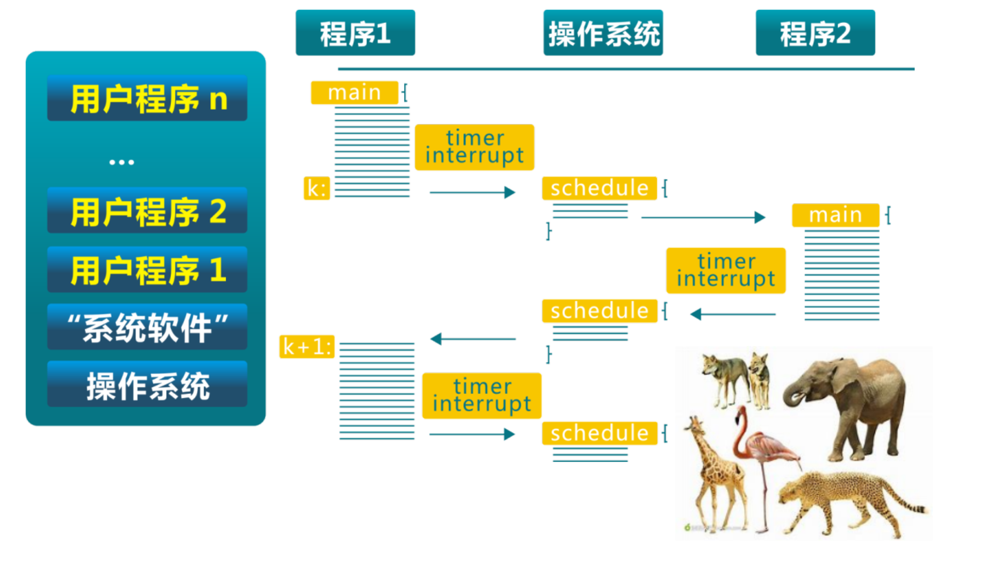
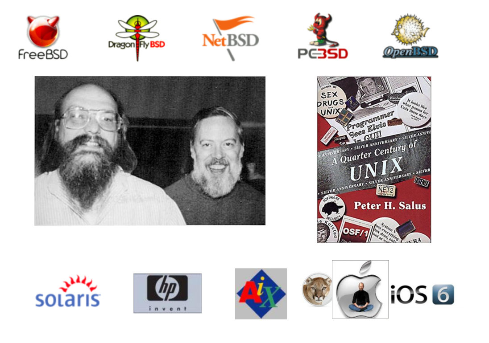
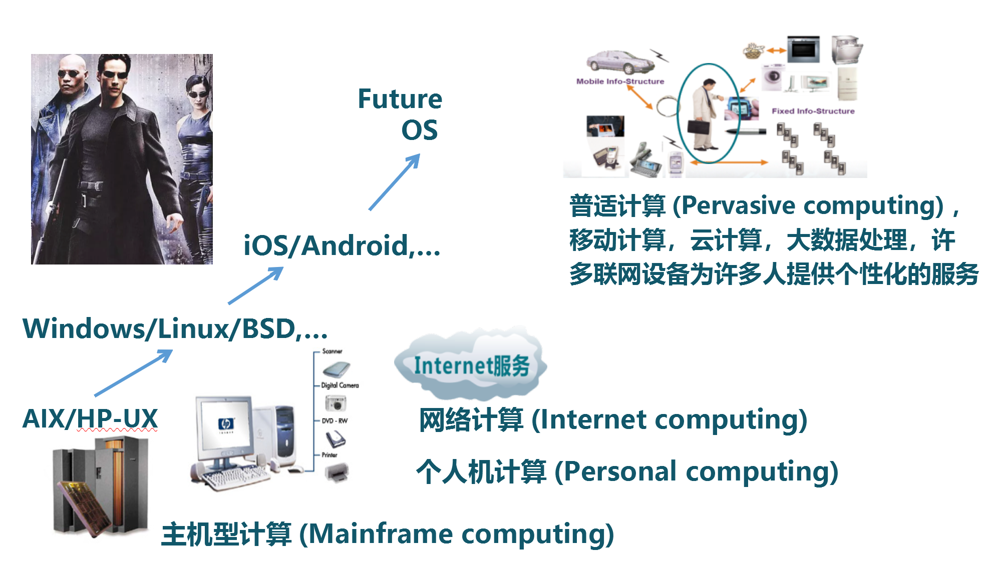

## 第一讲 操作系统概述

### 第三节 操作系统历史演化

 
 

向勇 陈渝 李国良 任炬 

 
 

2024年春季

---

## 单用户系统

单用户系统 (1945-1955)

- **手动**连线/纸带传输进行程序输入
- 机器成本远大于人力**成本**
- **操作系统 = 装载器 + 程序库**
- 问题：昂贵组件的**低利用率**

---

## 批处理系统

批处理系统 (1955-1965)

- **磁带/磁盘传输**进行程序输入
- 机器成本大于人力成本
- 操作系统 = 装载器 + **程序控制器 + 输出处理器**
- 问题：相比以前利用率提高

---

## 批处理系统

**批处理**系统 (1955-1965)

- 磁带/磁盘传输进行程序输入
- 机器成本大于人力成本
- 操作系统 = 装载器 + 程序控制器 + 输出处理器
- 问题：相比以前利用率提高

---

## 多道程序系统

**多道**程序系统 (1955-1980)

- 多个程序驻留**内存**中
- 多个程序轮流使用 **CPU**
- 操作系统 = 装载器 + **程序调度 + 内存管理** + 输出管理
- 演变：相比以前利用率提高

---

## 分时系统

分时系统 (1970- 至今)  
- 多个程序驻留内存中  
- 多个程序分时使用 CPU  
- 操作系统 = 装载器 + 程序调度 + 内存管理 + **中断处理** +...  
- 演变：相比以前利用率提高、与外界**交互延时**缩短

---
## Multics OS

---
## Multics OS

---
## 开放的UNIX（Ken Thompson 与 Dennis Ritchie）

---
## Linux家族

---
## 个人电脑

个人电脑 (1981- )
- 单用户
- **计算机成本下降**使CPU利用率不再是最重要的关注点
- 重点是**用户界面和多媒体功能**
- 操作系统 = 装载器 + 程序调度 + 内存管理 + 中断处理 +...
- 演变：**走向大众**，老的服务和功能不存在，越来越多的安全问题

---
## MacOS家族

---
## MacOS家族

---
## Windows家族

---
## 分布式系统

**分布式**系统 (1990- )
- 分布式多用户
- 分布式系统利用率是关注点
- 重点是网络/存储/计算的效率
- 操作系统 = 分布式（装载器 + 程序/OS 调度 + 内存管理）
- 演变：走向大众，走向**网络**，新的挑战 (不可靠/不确定)

---
## Android操作系统
- 跨平台：支持Java应用程序
- 运行时(runtime)：Android虚拟机
- 应用框架：简化应用程序开发

---
## AIoT操作系统

AIoT 系统 (2000- )
- 分布式**多设备**
- 分布式系统利用率/可用性是关注点
- 重点是网络/存储/计算的效率
- 操作系统 = 分布式（程序/OS 调度 + 内存管理 + 安全/更新）
- 演变：走向设备，走向网络，新的挑战 (不可靠/大数据)

---

# 【GPT 笔记】

本节展示了操作系统从早期的单用户系统到现代AIoT操作系统的发展历程。我们将通过不同的时代，一步步解释并扩展这些内容。

### 单用户系统 (1945-1955)

在计算机技术的早期，计算机由单个用户直接操作，通过手动连线或纸带传输输入程序。这个时期的操作系统非常原始，主要由装载器和程序库组成。这种方式的主要问题是昂贵的计算机组件利用率低下，因为每次只能运行一个任务。

### 批处理系统 (1955-1965)

为了提高计算机的利用率，批处理系统被引入。这种系统允许将多个作业集合起来，然后一次性处理，使用磁带或磁盘进行程序输入。操作系统在这时期开始具备程序控制器和输出处理器，能够自动地装载、执行和管理作业队列。

### 多道程序系统 (1955-1980)

多道程序系统允许多个程序同时驻留在内存中，CPU在这些程序间切换，以提高计算机资源的利用率。这种方式引入了程序调度、内存管理和输出管理，是操作系统功能大幅度增加的一个时期。

### 分时系统 (1970-至今)

分时系统的出现是为了进一步提高计算机资源的利用率，并减少用户与系统交互的延时。在这种系统中，多个用户通过终端与同一台计算机交互，计算机分时处理各个用户的请求。操作系统加入了中断处理功能，使得交互更为实时。

### Multics OS

Multics是一种早期的分时操作系统，对后来的操作系统，特别是UNIX有着重要影响。它引入了很多现代操作系统的概念，如分层结构、环形保护等。

### UNIX系统

由Ken Thompson与Dennis Ritchie开发的UNIX系统，以其强大的网络功能、多用户支持和强大的命令行接口著称。UNIX系统的设计哲学和架构对后来的许多操作系统产生了深远影响，包括Linux家族和MacOS家族。

### Linux家族

Linux是一种免费和开源的UNIX-like操作系统，由Linus Torvalds在1991年首次发布。Linux家族包括众多的发行版，适用于个人电脑、服务器到嵌入式设备。

### 个人电脑 (1981- )

随着计算机成本的下降，个人电脑成为普及。操作系统开始重视用户界面和多媒体功能，如Windows和MacOS家族，它们提供了图形用户界面和丰富的应用程序支持。

### 分布式系统 (1990- )

分布式系统由多台计算机组成，它们通过网络连接，共同完成任务。这种系统的操作系统重点在于提高网络、存储和计算效率，如分布式文件系统和计算集群。

### Android操作系统

Android是一种基于Linux内核的移动操作系统，它支持跨平台的Java应用程序。它的应用框架为开发者提供了强大的工具和API，简化了移动应用的开发。

### AIoT操作系统

随着物联网和人工智能技术的发展，AIoT操作系统应运而生。这些系统连接多种设备，重点在于提高网络、存储和计算的效率，同时关注系统的可用性和安全性。

### 总结

操作系统的发展历程展示了技术进步如何推动计算模式的演变，从早期的单任务处理到今天的云计算和物联网。每个阶段的转变都是为了提高效率、增加用户交互的响应性和提供新的功能。随着技术的不断发展，未来的操作系统将继续适应新的计算需求和挑战。
