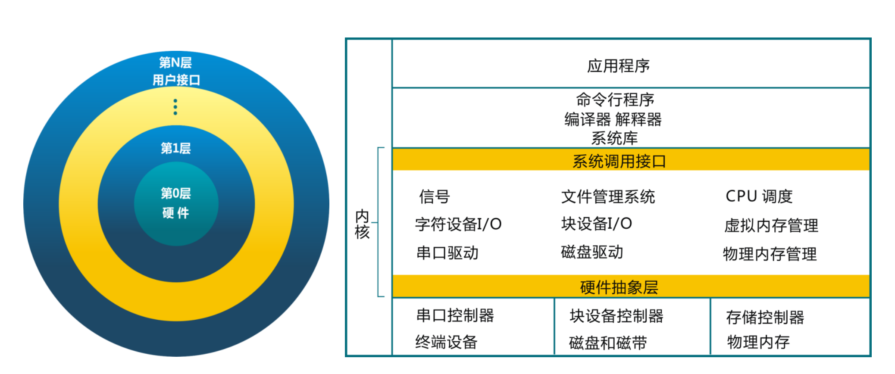
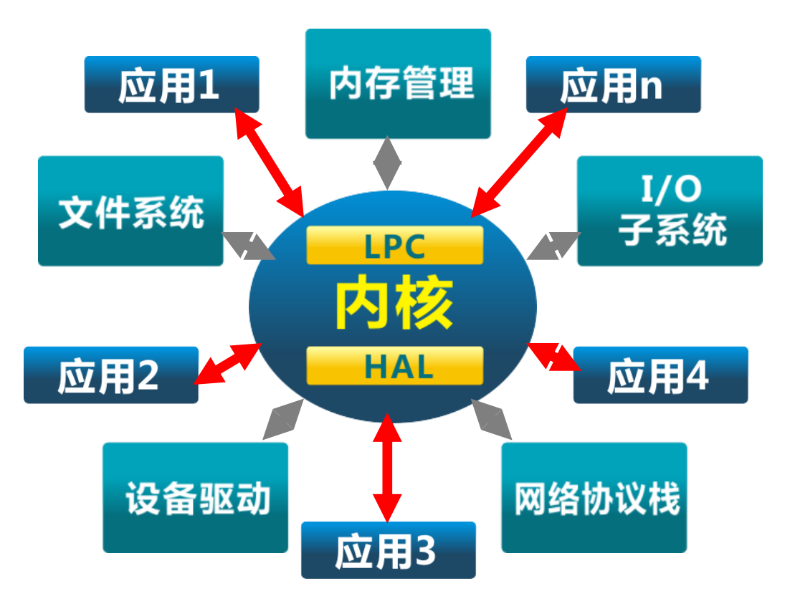
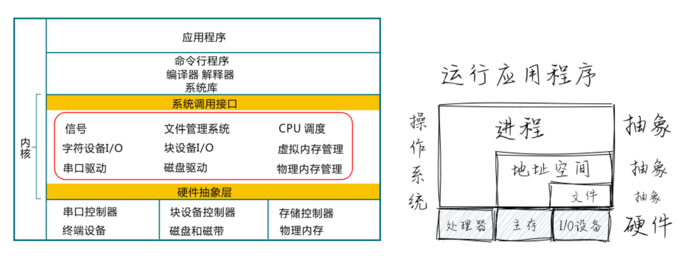

## 第一讲 操作系统概述

### 第四节 操作系统结构

向勇 陈渝 李国良 任炬 

2024年春季

---
## 简单结构
MS-DOS：应用和OS混在一起 (1981–1994)
- **没有拆分为模块**
- 主要用汇编编写
- 没有安全保护

---
## 单体分层结构
将单体操作系统 (Monolithic OS) 划分为**多层** (levels)
- 每层建立在低层之上
- 最底层 (layer 0), 是硬件驱动
- 最高层 (layer N) 是用户界面
- 每一层仅使用更低一层的功能和服务

---
## 微内核结构(Micro Kernel)
- **尽可能把内核功能移到用户空间**
- 用户模块间的通信使用消息传递
- 好处: 灵活/安全...
- 缺点: 性能
- LPC: 本地过程调用(Local Procedure Call)
- HAL: 硬件抽象层（Hardware Abstraction Layer）

---
## 外核结构(Exokernel)
- 让内核分配物理资源给多个应用程序, 并让每个程序决定如何处理这些资源
- 程序能链接到操作系统库 (libOS) 实现了操作系统抽象
- **保护与控制分离**
- Distributed Shared Memory(DSM)

---
## 虚拟机结构
虚拟机管理器将单独的机器接口转换成很多的虚拟机, 每个虚拟机都是一个原始计算机系统的有效副本, 并能完成所有的处理器指令

---
## 虚拟机结构

---
## 应用程序运行与 OS 抽象 + 架构的关系

---

# 【GPT 笔记】

本节讲述了操作系统结构的不同类型和它们各自的特点、优势与局限。通过展示从早期的简单结构到现代复杂架构的演进，我们可以理解操作系统设计的多样性和其对软硬件兼容性、性能、安全性及灵活性的影响。

### 简单结构

**MS-DOS**是最早期的操作系统之一，以其简单的结构为特点。在MS-DOS中，应用程序和操作系统代码混合在一起，几乎没有模块化的概念。这种结构简化了操作系统的设计，但因缺乏安全和模块化，使得系统维护和更新变得困难。

### 单体分层结构

单体分层结构通过将操作系统分为多个层次来解决简单结构的一些问题。每一层提供一组功能，仅依赖于其下一层的服务。这种结构增加了操作系统的可维护性和模块化，但可能会引入一些性能开销，因为每个操作都可能需要通过多个层次才能完成。

### 微内核结构

微内核结构旨在将尽可能多的操作系统功能从内核移至用户空间，通过消息传递机制在用户模块间通信。这种设计提高了系统的灵活性和安全性，因为它减少了内核的复杂性和出错的可能性。然而，频繁的上下文切换和消息传递可能导致性能损失。

### 外核结构

外核架构尝试解决微内核可能带来的性能问题，通过允许应用程序直接控制物理资源，同时保持对这些资源的基本保护。这种方法提高了灵活性和性能，因为应用可以更直接地管理其所需的资源，但这也增加了编程的复杂性和出错的风险。

### 虚拟机结构

虚拟机结构使用虚拟机监控器（VMM）将单一物理机的资源虚拟化为多个独立的虚拟机，每个虚拟机都能运行一个完整的操作系统实例。这种结构提供了高度的隔离性和灵活性，允许在同一物理硬件上运行不同操作系统和配置，但可能会引入一定的性能开销。

### 应用程序运行与OS抽象+架构的关系

不同的操作系统架构提供了不同级别的抽象和服务，这直接影响了应用程序的运行方式和性能。操作系统的抽象层为应用程序提供了一个统一的接口来访问底层硬件资源，如CPU、内存和I/O设备，同时也定义了应用程序与系统资源交互的规则和约束。

### 总结

随着计算需求的不断演变，操作系统架构也在不断地发展以适应这些变化。从简单的MS-DOS到现代的微内核和虚拟机架构，每种设计都旨在平衡性能、安全性、灵活性和可维护性。了解这些不同的架构及其背后的设计原则，对于理解现代计算环境以及如何最有效地利用操作系统提供的服务至关重要。