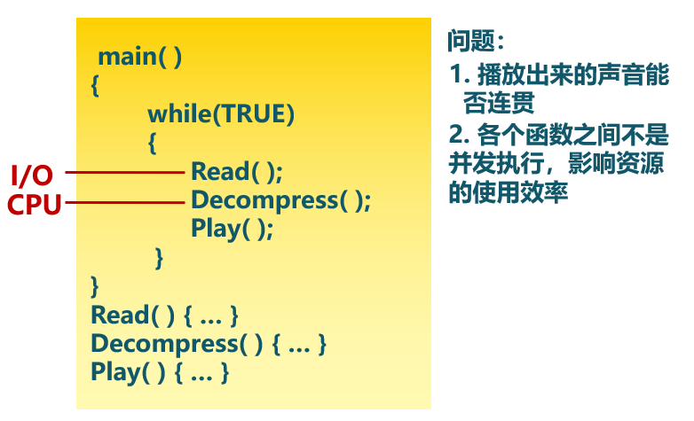
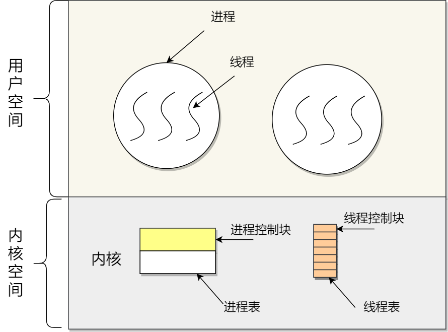
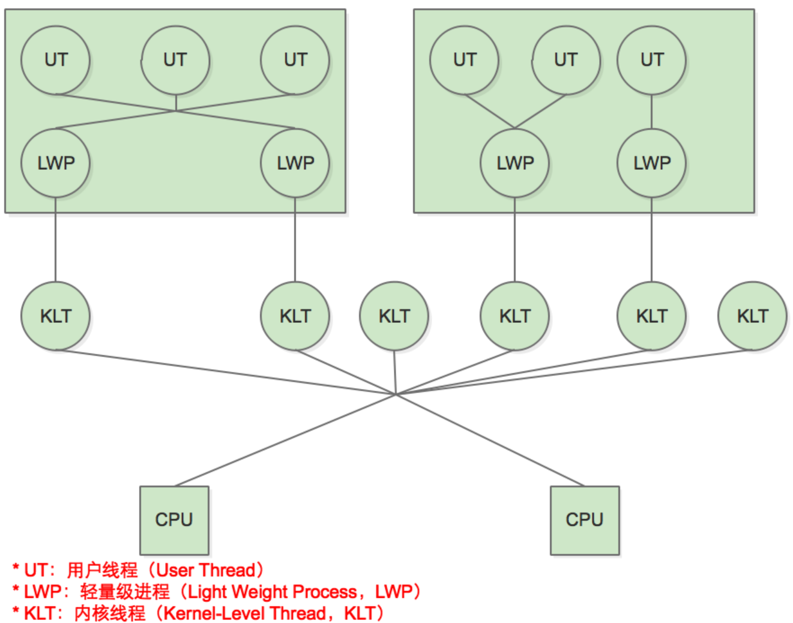
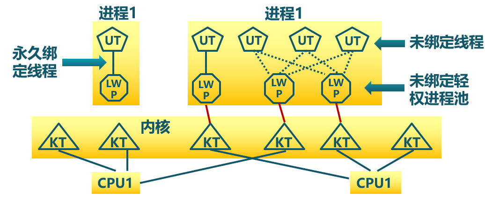

# 第十一讲 线程与协程

## 第一节 线程

<br>
<br>

向勇 陈渝 李国良 任炬 

2023年秋季

---

**提纲**

### 1. 为何需要线程？
2. 线程的概念
3. 使用线程
4. 线程的设计实现

---

##### 进程存在的不足

-  进程之间地址空间隔离
-  通过IPC共享/交换数据不方便
-  管理进程开销大
  - 创建/删除/切换
-  并行/并发处理困难


---

##### 进程存在的不足

-  进程之间地址空间隔离
-  通过IPC共享/交换数据不方便
-  管理进程开销大
  - 创建/删除/切换
-  并行/并发处理困难


---

##### 为何需要线程？

* 在应用中可能同时发生多种活动，且某些活动会被阻塞
* 将**程序分解成可并行运行的多个顺序控制流**
  * 可提高执行**效率**
  * 程序设计模型也会变得更**简单**


<!--

-->

---

##### 为何需要线程？
永远存在的用户需求 -- **性能**！
-  并行实体（多个顺序控制流）共享同一个地址空间和所有可用数据
  - 访问数据和共享资源方便
  - 切换控制流轻量
  - 管理不同控制流便捷 


---

##### 线程 vs 进程
- 进程是资源（包括内存、打开的文件等）分配的单位，线程是 CPU 调度的单位；
- 进程拥有一个完整的资源平台，而线程只独享必不可少的资源，如寄存器和栈；
- 线程同样具有就绪、阻塞、执行三种基本状态，同样具有状态之间的转换关系；
- 线程能减少并发执行的时间和空间开销；

---

##### 线程 vs 进程
- 一个进程中可以同时存在多个线程；
- 各个线程之间可以并发执行；
- 各个线程之间可以共享地址空间和文件等资源；
- 当进程中的一个线程崩溃时，会导致其所属进程的所有线程崩溃（这里是针对 C/C++ 语言，Java语言中的线程崩溃不会造成进程崩溃）。

---

**提纲**
<style>
.container{
    display: flex;    
}
.col{
    flex: 1;
}
</style>

<div class="container">

<div class="col">

1. 为何需要线程？
### 2. 线程的概念
3. 使用线程
4. 线程的设计实现

</div>

<div class="col">

#### 2.1 线程的定义
2.2 线程管理

</div>

</div>

---

##### 线程的定义

线程是进程的一**部分**，描述指令流**执行状态**。它是进程中的指令执行流的基本单元，是CPU调度的**基本单位**。


---

##### 进程和线程的角色

- 进程的**资源分配**角色
  - 进程由一组相关资源构成，包括地址空间（代码段、数据段）、打开的文件等各种资源

- 线程的**处理机调度**角色
  - 线程描述在进程资源环境中的指令流执行状态


---

##### 不同操作系统对线程的支持


---

##### 进程和线程的关系

**进程 = 线程 + 共享资源**
- 一个进程中可存在多个线程
- 线程共享进程的地址空间
- 线程共享进程的资源
- 线程崩溃会导致进程崩溃

线程是一个调度实体 Scheduling Entry
User-SE  v.s.  Kernel-SE 


---

##### 线程与进程的比较
- 进程是资源分配单位，线程是CPU调度单位
- 进程拥有一个完整的资源平台，而线程只独享指令流执行的必要资源，如寄存器和栈
- 线程具有就绪、等待和运行三种基本状态和状态间的转换关系
- 线程能减少并发执行的时间和空间开销
  - 线程的创建/终止/切换时间比进程短
  - 同一进程的各线程间共享内存和文件资源，可不通过内核进行直接通信

---

**提纲**
<style>
.container{
    display: flex;    
}
.col{
    flex: 1;
}
</style>

<div class="container">

<div class="col">

1. 为何需要线程？
2. **线程的概念**
3. 使用线程
4. 线程的设计实现

</div>

<div class="col">

2.1 线程的定义
#### 2.2 线程管理

</div>

</div>

---

##### 用户态管理的线程与内核态管理的线程




---

##### 线程控制块(TCB, Thread Control Block)
```c
typedef struct
{
       int                       detachstate;   // 线程的分离状态
       int                       schedpolicy;   // 线程调度策略 FIFO、RR等
       structsched_param         schedparam;    // 线程的调度参数 优先级
       int                       inheritsched;  // 线程的继承性
       int                       scope;         // 线程的作用域进程级、系统级
       size_t                    guardsize;     // 线程栈末尾的警戒缓冲区大小
       int                       stackaddr_set; // 线程的栈设置
       void*                     stackaddr;     // 线程栈的位置，起始地址
       size_t                    stacksize;     // 线程栈的大小
} pthread_attr_t;
```
---

##### 创建线程API
创建线程：成功返回零，否则返回非零值
```c
#include <pthread.h>
int pthread_create(      pthread_t *        thread,
               const pthread_attr_t *       attr,
                     void *                 (*start_routine)(void*),
                     void *                 arg);
```       
- thread指向pthread_t结构类型的指针
- attr用于指定该线程可能具有的任何属性
- start_routine是线程开始运行的函数指针
- arg是要传递给线程开始执行的函数的参数

---

##### 等待线程API

等待线程：一直阻塞调用它的线程，直至目标线程执行结束
```c
#include <pthread.h>
int pthread_join(pthread_t thread, void **retval);
```       
- thread指向pthread_t结构类型的指针
- retval是指向返回值的指针

---

**提纲**

1. 为何需要线程？
2. 线程的概念
### 3. 使用线程
4. 线程的设计实现

---

##### 线程示例

```c
1    void *mythread(void *arg) {
2        printf("%s\n", (char *) arg);
3        return NULL;
4    }
5    int main(int argc, char *argv[]) {
6       pthread_t p1, p2;
7       int rc;
8       printf("main: begin\n");
9       rc = pthread_create(&p1, NULL, mythread, "A"); assert(rc == 0);
10      rc = pthread_create(&p2, NULL, mythread, "B"); assert(rc == 0);
11      // join waits for the threads to finish
12      rc = pthread_join(p1, NULL); assert(rc == 0);
13      rc = pthread_join(p2, NULL); assert(rc == 0);
14      printf("main: end\n");
15      return 0;
16   }
```

---

##### 线程示例输出

一个程序，它创建两个线程，每个线程都做了一些独立的工作，在这例子中，打印“A”或“B”。

```
❯ ./t0
main: begin
A
B
main: end
```

---

**提纲**
<style>
.container{
    display: flex;    
}
.col{
    flex: 1;
}
</style>

<div class="container">

<div class="col">

1. 为何需要线程？
2. 线程的概念
3. 使用线程
### 4. 线程的设计实现

</div>

<div class="col">

#### 4.1 用户态管理且用户态运行的线程
4.2 内核态管理且用户态运行的线程
4.3 内核态管理且内核态运行的线程
4.4 混合管理且运行的线程
</div>

</div>

---

##### 线程的几种实现方式 
- 用户态管理且用户态运行的线程（内核不可见的用户线程）
   - Thread managed&running in User-Mode
- 内核态管理且用户态运行的线程（内核可见的用户线程）
   - Thread managed in Kernel-Mode&running in User-Mode
- 内核态管理且内核态运行的线程（内核线程）
   - Thread managed&running in Kernel-Mode
- 混合管理且运行的线程（轻量级进程，混合线程）
   - Thread managed&running in Mixed-Mode
---

##### 用户态管理且用户态运行的线程

- 在用户态实现线程的管理与运行，操作系统感知不到这类线程的存在
   -  POSIX Pthreads，Mach C-threads，Solaris threads
   - 别名：用户态线程(User-level Thread)、绿色线程(Green Thread)、有栈协程(Stackful Coroutine)、纤程(Fiber)


---

##### 用户态管理且用户态运行的线程

- 由一组用户级的线程库函数来完成线程的管理，包括线程的创建、终止、同步和调度等


---

##### 用户态管理线程的优点

- 线程的调度不需要内核直接参与，控制简单。
- 可以在不支持线程的操作系统中实现。
- 创建和销毁线程、线程切换等线程管理的代价比内核线程少得多。
- 允许每个进程定制自己的调度算法，线程管理比较灵活。
- 线程能够利用的表空间和堆栈空间比内核级线程多。
- 同一进程中只能同时有一个线程在运行，如果有一个线程使用了系统调用而阻塞，那么整个进程都会被挂起。

---

##### 用户态管理线程的不足
-  一个线程发起系统调用而阻塞时，则整个进程进入等待
-  不支持基于线程的处理机抢占
-  只能按进程分配CPU时间
- 多个处理机下，同一个进程中的线程只能在同一个处理机下分时复用


---

**提纲**
<style>
.container{
    display: flex;    
}
.col{
    flex: 1;
}
</style>

<div class="container">

<div class="col">

1. 为何需要线程？
2. 线程的概念
3. 使用线程
4. **线程的设计实现**

</div>

<div class="col">

4.1 用户态管理且用户态运行的线程
#### 4.2 内核态管理且用户态运行的线程
4.3 内核态管理且内核态运行的线程
4.4 混合管理且运行的线程
</div>

</div>

---

##### 内核态管理且用户态运行的线程

- 由内核通过系统调用实现的线程机制，由内核完成线程的创建、终止和管理
- 由内核维护线程控制块TCB, 在内核实现
- 线程执行系统调用而被阻塞不影响其他线程


---

##### 内核态管理且用户态运行的线程 

- 一个进程中可以包括多个线程
   - Windows内核的设计 
   - rCore/uCore内核的设计
- 一个进程中只包括一个线程
  - Linux内核的设计


---

##### 内核态管理且用户态运行线程的不足

- 在一般情况下，线程切换开销与进程切换开销相差不大，大于用户态管理且用户态允许的线程切换开销
- 与传统的进程管理机制会产生一些矛盾，一些系统调用的实现功能/语义上会不协调
  - fork()、signal() ...


---

##### 多线程`fork()`引起的问题

多线程应用程序中，建议谨慎使用 `fork()`
- 竞态条件：线程正在修改共享变量或资源时调用了`fork()`，会导致子进程继承这个状态和资源的不一致性
- 死锁：线程正在持有某个锁或资源时调用`fork()`，可能导致子进程无法获得该锁而导致死锁
- 内存占用：多线程`fork()`会复制整个进程的地址空间，包括所有线程所拥有的栈、寄存器和锁等资源
- 性能下降：多线程`fork()`的开销较大，可能会影响应用程序的性能

<!--
因此，在多线程应用程序中，建议谨慎使用 fork()，尤其是当涉及到共享资源和锁时。可以采用其他技术来实现进程间通信和同步，例如共享内存、消息队列和信号量等。
-->

---

**提纲**
<style>
.container{
    display: flex;    
}
.col{
    flex: 1;
}
</style>

<div class="container">

<div class="col">

1. 为何需要线程？
2. 线程的概念
3. 使用线程
4. **线程的设计实现**

</div>

<div class="col">

4.1 用户态管理且用户态运行的线程
4.2 内核态管理且用户态运行的线程
#### 4.3 内核态管理且内核态运行的线程
4.4 混合管理且运行的线程

</div>

</div>

---

##### 内核态管理且内核态运行的线程（简称：内核线程）
- 由内核实现线程机制，由内核完成线程的创建、终止和管理
- 由内核维护TCB, 在内核实现
- 线程在内核中执行
   - 如：Linux的内核线程 


---

##### 内核态管理且内核态运行的线程
- 一个内核线程可分时/并行处理一件内核任务
- 内核线程的调度由内核负责，一个内核线程处于阻塞状态时不影响其他的内核线程


---

##### 内核态管理且内核态运行的线程的作用
- 执行周期性的任务
  -  把Buffer-Cache定期写回到存储设备上
  -  在可用物理内存页很少情况下执行虚存交换操作 
  -  实现文件系统的事务日志
  -  ......
   


---

**提纲**
<style>
.container{
    display: flex;    
}
.col{
    flex: 1;
}
</style>

<div class="container">

<div class="col">

1. 为何需要线程？
2. 线程的概念
3. 使用线程
4. **线程的设计实现**

</div>

<div class="col">

4.1 用户态管理且用户态运行的线程
4.2 内核态管理且用户态运行的线程
4.3 内核态管理且内核态运行的线程
#### 4.4 混合管理且运行的线程

</div>

</div>

---

##### 轻量级进程：双态管理的线程

轻量级进程（Light-Weight Process，LWP）是内核支持的用户线程
* 一个进程可有一个或多个 LWP，每个 LWP 是跟内核线程一对一映射的，也就是 LWP 都是由一个内核线程支持。 
* 在 LWP 之上也可使用用户线程。

---

##### 轻权进程与用户线程的对应关系

- 1 : 1，即一个 LWP 对应 一个用户线程：Linux, JVM 
  - 用户态管理取消，内核管理线程
- N : 1，即一个 LWP 对应多个用户线程：与OS无关的Green Thread 
  - 内核态仅管理包含多个线程的进程，用户态的线程运行时管理线程
- M : N，即多个 LWP 对应多个用户线程：Solaris OS, Go runtime
  - 用户态线程运行时和内核协同进行管理

---

##### 轻权进程实例

M : N线程模型
- Solaris 操作系统+C线程运行时库
- Go语言+Go运行时库+OS



---

##### 轻权进程管理
  - **编程人员**决定内核线程与用户级线程的对应关系
  - **用户级线程**由用户线程管理库管理
  - **内核**只识别内核级线程/进程，并对其进行调度
  - 内核与用户态线程管理库交互
  - 具有最大灵活度和实现复杂性



---

##### 线程的上下文切换

线程是调度的基本单位，而进程则是资源拥有的基本单位。

- 不同进程中的线程切换：进程上下文切换
- 相同进程中的线程切换：虚拟内存等**进程资源**保持不动，只需要切换**线程的私有数据、寄存器**等不共享的数据

---

### 小结

1. 为何需要线程？
2. 线程的概念
3. 使用线程
4. 线程的设计实现
