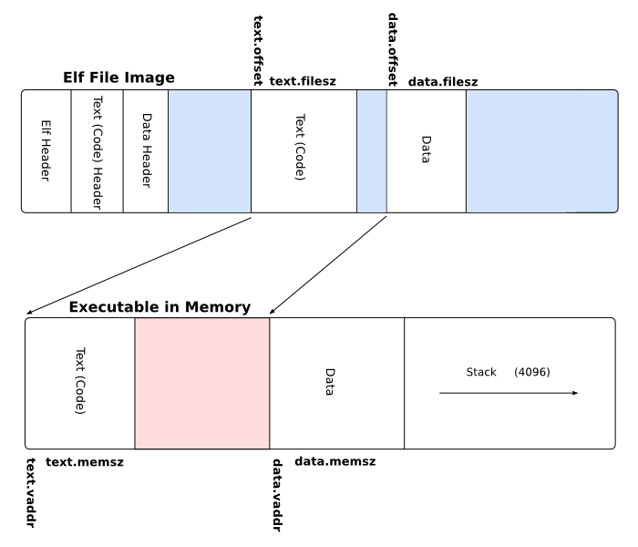

# 第二讲 实践与实验介绍
## 第二节 Compiler与OS


向勇 陈渝 李国良 任炬 


2024年春季

---
### 提纲

### 1. 硬件环境
2. 应用程序执行环境
3. 操作系统执行环境

---

#### 开发的硬件环境


---

#### 目标硬件环境


---
### 提纲

1. 硬件环境
### 2. 应用程序执行环境
3. 操作系统执行环境

---

#### 编译器工作
- 源码-->汇编码

---

#### Assembler（汇编器）工作
- 汇编码 --> 机器码

---
#### linker（链接器）工作
- 多个机器码目标文件 --> 单个机器码执行文件


---

#### OS工作
- 加载/执行/管理机器码执行文件


---
### 提纲

1. 硬件环境
2. 应用程序执行环境
### 3. 操作系统执行环境

---

#### 编译器/汇编器/链接器工作
- 源码 ---> 汇编码 ---> 机器码 --->执行程序
- Bootloader加载OS执行


---

#### 可执行文件格式
三元组
* CPU 架构/厂商/操作系统
```
rustc --print target-list | grep riscv
riscv32gc-unknown-linux-gnu
...
riscv64gc-unknown-linux-gnu
riscv64imac-unknown-none-elf
```
* ELF: Executable and Linkable Format


---

#### 链接和执行


---
#### 函数库
- 标准库：依赖操作系统
  - Rust: std 标准库
  - C：glibc, musl libc 
- 核心库：与操作系统无关
  - Rust: core 核心库
  - C: Linux/BSD kernel libc
  

---
#### 裸机程序
与操作系统无关的OS类型的程序（Bare Metal program, 裸机程序）
```
// os/src/main.rs
#![no_std]
#![no_main]

mod lang_items;

// os/src/lang_items.rs
use core::panic::PanicInfo;

#[panic_handler]
fn panic(_info: &PanicInfo) -> ! {
    loop {}
}
```

---
#### ELF文件格式

文件格式
```
file target/riscv64gc-unknown-none-elf/debug/os
target/riscv64gc-unknown-none-elf/debug/os: ELF 64-bit LSB executable, UCB RISC-V, ......
```
[ELF文件格式](https://wiki.osdev.org/ELF) Executable and Linkable Format

---
#### ELF文件格式



---
#### 文件头信息

文件头信息
```
rust-readobj -h target/riscv64gc-unknown-none-elf/debug/os
   File: target/riscv64gc-unknown-none-elf/debug/os
   Format: elf64-littleriscv
   Arch: riscv64
   AddressSize: 64bit
   ......
   Type: Executable (0x2)
   Machine: EM_RISCV (0xF3)
   Version: 1
   Entry: 0x0
   ......
   }
```

---
#### 导出汇编程序


反汇编导出汇编程序
```
rust-objdump -S target/riscv64gc-unknown-none-elf/debug/os
   target/riscv64gc-unknown-none-elf/debug/os:       file format elf64-littleriscv
```
代码中移除了 main 函数并将项目设置为 #![no_main] 
 - 没有一个传统意义上的入口点（即程序首条被执行的指令所在的位置）
 - Rust 编译器会生成一个空程序
 - 这是一个**面向操作系统开发**的程序

---
#### App/OS内存布局
- .text: 代码段
- .rodata：已初始化数据段，只读的全局数据（常数或者是常量字符串）
- .data：可修改的全局数据
- .bss：未初始化数据段（Block Started by Symbol）
- 堆 （heap）向高地址增长
- 栈 （stack）向低地址增长


---

# 【总结笔记】

本节内容围绕编译器、操作系统（OS）以及它们在软件开发和执行过程中的作用。课程内容涵盖硬件环境、应用程序执行环境、以及操作系统执行环境三个主要部分。

#### 应用程序执行环境

- **编译器**：将源代码转换为汇编语言。
- **汇编器**（Assembler）：将汇编语言转换为机器语言（机器码）。
- **链接器**（Linker）：将多个机器码目标文件链接成一个单独的可执行机器码文件。

#### 操作系统执行环境

- **OS的角色**：负责加载、执行、和管理应用程序的机器码执行文件。
- **Bootloader**：负责加载操作系统。

### 可执行文件格式

- **Executable and Linkable Format (ELF)**：广泛使用的可执行文件格式，包含重要的元信息，如CPU架构、厂商和操作系统等。
- **ELF文件格式**：是Linux和许多Unix-like系统中广泛采用的标准文件格式，用于可执行文件、目标代码、共享库和核心转储。

### 函数库

- **标准库**：依赖操作系统的库，如Rust的std库和C的glibc。
- **核心库**：与操作系统无关的库，如Rust的core库。

### 裸机程序

- 与操作系统无关，直接运行在硬件上的程序。通过特定的编程模式（如Rust语言的`#![no_std]`和`#![no_main]`属性），可以编写不依赖于标准库的裸机程序。
- **裸机编程**：在没有操作系统支撑的环境下进行编程，常见于嵌入式系统和系统启动代码的开发中。

### ELF文件格式深入

- **文件头信息**：提供了文件的基本信息，如架构、地址大小、文件类型等。
- **导出汇编程序**：通过反汇编工具查看和导出程序的汇编代码。

### App/OS内存布局

- **内存分区**：包括代码段、数据段（已初始化和未初始化）、堆和栈。
- **内存管理**：堆向高地址增长，而栈向低地址增长。
- **内存布局**：对于任何复杂的应用程序或操作系统来说，合理的内存布局是性能和安全的关键。
