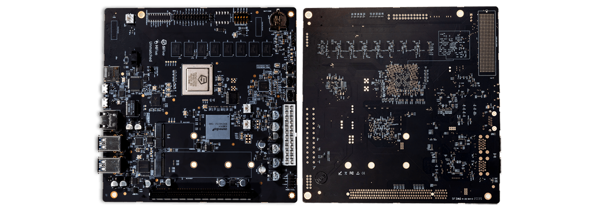

# 第二讲 实践与实验介绍
## 第三节 硬件启动与软件启动


向勇 陈渝 李国良 任炬 


2024年春季

---
提纲

### 1. RISC-V开发板
2. QEMU启动参数和流程
3. x86启动流程

---
#### K210开发板
- 基于RISC-V 64 多核处理器


---
#### 哪吒D1开发板
- 基于RISC-V 64 单核处理器


---
#### HiFive Unmatched 开发板（U740）
- 基于RISC-V 64 多核处理器


---
提纲

1. RISC-V开发板
### 2. QEMU启动参数和流程
3. x86启动流程

---

#### QEMU模拟器

使用软件 qemu-system-riscv64 来模拟一台 64 位 RISC-V 架构的计算机，它包含:
- 一个 CPU（可调整为多核）
- 一块物理内存
- 若干 I/O 外设

---
#### QEMU启动参数
```
qemu-system-riscv64 \
    -machine virt \
    -nographic \
    -bios ../bootloader/rustsbi-qemu.bin \
    -device loader,file=target/riscv64gc-unknown-none-elf/release/os.bin,addr=0x80200000
```
- machine virt 表示将模拟的 64 位 RISC-V 计算机设置为名为 virt 的虚拟计算机
- 物理内存的默认大小为 128MiB 

---
#### QEMU启动参数
```
qemu-system-riscv64 \
    -machine virt \
    -nographic \
    -bios ../bootloader/rustsbi-qemu.bin \
    -device loader,file=target/riscv64gc-unknown-none-elf/release/os.bin,addr=0x80200000
```
- nographic 表示模拟器不需要提供图形界面，而只需要对外输出字符流


---
#### QEMU启动参数
```
qemu-system-riscv64 \
    -machine virt \
    -nographic \
    -bios ../bootloader/rustsbi-qemu.bin \
    -device loader,file=target/riscv64gc-unknown-none-elf/release/os.bin,addr=0x80200000
```
- bios 可以设置 QEMU 模拟器开机时用来初始化的引导加载程序（bootloader）
- 这里使用预编译好的 rustsbi-qemu.bin

---
#### QEMU启动参数
```
qemu-system-riscv64 \
    -machine virt \
    -nographic \
    -bios ../bootloader/rustsbi-qemu.bin \
    -device loader,file=target/riscv64gc-unknown-none-elf/release/os.bin,addr=0x80200000
```
- device的loader 参数可以在 QEMU 模拟器开机之前将一个宿主机上的文件载入到 QEMU 的物理内存的指定位置中
- file 和 addr 参数分别可以设置待载入文件的路径以及将文件载入到的 QEMU 物理内存上的物理地址

---
#### QEMU启动流程

```
qemu-system-riscv64 \
    -machine virt \
    -nographic \
    -bios ../bootloader/rustsbi-qemu.bin \
    -device loader,file=target/riscv64gc-unknown-none-elf/release/os.bin,addr=0x80200000
```
- 通常计算机加电之后的启动流程可以分成若干个阶段，每个阶段均由一层软件负责
- 每一层软件在完成它承担的初始化工作，然后跳转到下一层软件的入口地址，将计算机的控制权移交给了下一层软件。

---
#### QEMU启动流程

```
qemu-system-riscv64 \
    -machine virt \
    -nographic \
    -bios ../bootloader/rustsbi-qemu.bin \
    -device loader,file=target/riscv64gc-unknown-none-elf/release/os.bin,addr=0x80200000
```
QEMU 模拟的启动流程则可以分为三个阶段：
1. 由固化在 [QEMU模拟的计算机内存](https://github.com/LearningOS/qemu/blob/386b2a5767f7642521cd07930c681ec8a6057e60/hw/riscv/virt.c#L59)中的[一小段汇编程序](https://github.com/LearningOS/qemu/blob/386b2a5767f7642521cd07930c681ec8a6057e60/hw/riscv/virt.c#L536)初始化并跳转执行bootloader；
2. 由 bootloader 负责，初始化并加载OS，跳转OS执行；
3. 由内核执行初始化工作。

---
提纲

1. RISC-V开发板
2. QEMU启动参数和流程
### 3. x86启动流程

---
#### 真实计算机(x86)的启动流程
基于x86的PC的启动固件的引导流程，从IBM PC机诞生第一天起，本质上就没有改变过。

1. Rom Stage：直接在ROM上运行BIOS代码；
2. Ram Stage：在RAM上运行代码，检测并初始化芯片组、主板等；
3. Bootloader Stage：在存储设备上找到Bootloader，加载执行Bootloader；
4. OS Stage：Bootloader初始化外设，在存储设备上找到OS，加载执行OS。

---

# 【总结笔记】

本节内容主要围绕RISC-V开发板、QEMU启动参数和流程，以及x86启动流程三个主要部分进行介绍。

### RISC-V开发板

本部分介绍了三种基于RISC-V架构的开发板：

- **K210开发板**：基于RISC-V 64位多核处理器。
- **哪吒D1开发板**：基于RISC-V 64位单核处理器。
- **HiFive Unmatched 开发板（U740）**：基于RISC-V 64位多核处理器。

这些开发板提供了实践RISC-V硬件开发的基础，展示了RISC-V架构的多样性和应用潜力。

### QEMU启动参数和流程

QEMU是一种常用的系统模拟器，可以模拟多种处理器架构，包括RISC-V。通过QEMU模拟器，可以模拟出一台具有CPU、物理内存和I/O外设的64位RISC-V计算机环境。

#### 主要启动参数：

- `-machine virt`：模拟一个名为`virt`的虚拟计算机，使用64位RISC-V架构。
- `-nographic`：QEMU不提供图形界面，仅输出字符流。
- `-bios`：指定QEMU模拟器启动时使用的引导加载程序（bootloader），如使用预编译的`rustsbi-qemu.bin`。
- `-device loader`：在QEMU开机前将宿主机上的文件（如操作系统镜像）载入到QEMU的物理内存的指定位置。

#### 启动流程：

QEMU的启动流程模拟了真实计算机的启动过程，包括以下阶段：

1. **初始化阶段**：QEMU模拟计算机通过内存中的一小段汇编程序初始化并跳转执行bootloader。
2. **Bootloader阶段**：bootloader负责初始化硬件环境，并加载操作系统到内存中，然后跳转到操作系统的入口点执行。
3. **操作系统阶段**：操作系统内核执行初始化工作，然后进入正常的运行状态。

### x86启动流程

x86架构计算机的启动流程自IBM PC机诞生之日起本质上未发生大的变化，分为以下阶段：

1. **ROM Stage**：在ROM上直接运行BIOS代码，负责硬件的最初级初始化。
2. **RAM Stage**：代码转移到RAM中执行，进行芯片组、主板等硬件的检测与初始化。
3. **Bootloader Stage**：BIOS在存储设备上寻找bootloader，加载并执行之，为操作系统的加载做准备。
4. **OS Stage**：Bootloader初始化外设，并在存储设备上找到操作系统，加载并将控制权交给操作系统。

通过这一系列阶段的介绍，我们可以看到无论是在传统的x86架构还是新兴的RISC-V架构上，计算机的启动过程都涉及到硬件初始化、bootloader的角色、以及操作系统的加载，这些过程对于理解计算机系统的工作原理至关重要。

---

## 【关于QEMU】

QEMU是一个流行的开源机器模拟与虚拟化软件，它支持多种硬件架构，包括x86、ARM、RISC-V等。通过QEMU，用户可以在不同的硬件平台上模拟运行操作系统和程序，这在开发、测试以及教学中非常有用。下面我们来详细解释QEMU启动参数，特别是那些用于模拟RISC-V架构的参数。

### 主要启动参数解释

#### -machine virt

- `-machine virt`参数指定QEMU模拟一个名为`virt`的虚拟机，这个虚拟机采用的是64位RISC-V架构。`virt`是一个为虚拟化而设计的简化版硬件平台，它提供了基本的硬件组件，如CPU、内存、以及一些输入输出设备，但没有过多复杂的外设，使得它非常适合用于教学、测试和开发目的。

#### -nographic

- `-nographic`参数告诉QEMU不提供图形界面，所有的输出和输入都通过终端进行。这对于运行没有图形界面或者不需要图形输出的操作系统和程序非常有用，如服务器操作系统、嵌入式系统或是在自动化测试脚本中使用QEMU时。

#### -bios

- `-bios`参数用于指定QEMU在模拟机器启动时使用的引导加载程序（bootloader）。在RISC-V架构中，这个bootloader负责一些基本的硬件初始化工作，并且负责加载并跳转到操作系统的入口。例如，使用`-bios ../bootloader/rustsbi-qemu.bin`指令，QEMU会加载一个预编译的名为`rustsbi-qemu.bin`的RISC-V启动引导程序。这个启动引导程序通常包含了为操作系统提供启动所需环境的最小必要代码。

#### -device loader

- `-device loader`参数用于在QEMU启动之前将一个文件从宿主机载入到QEMU模拟的物理内存中的指定位置。这对于加载操作系统镜像到模拟器的内存中非常关键。例如，`-device loader,file=target/riscv64gc-unknown-none-elf/release/os.bin,addr=0x80200000`告诉QEMU在物理地址`0x80200000`处加载`os.bin`文件。这允许操作系统镜像被直接放置到模拟内存中的正确位置，从而可以被bootloader正确地找到并执行。

这些参数合在一起，允许用户配置QEMU模拟出一个相对简单但足够用于运行操作系统的RISC-V虚拟机。通过这种方式，开发者可以在没有物理RISC-V硬件的情况下，开发和测试RISC-V操作系统和应用程序。