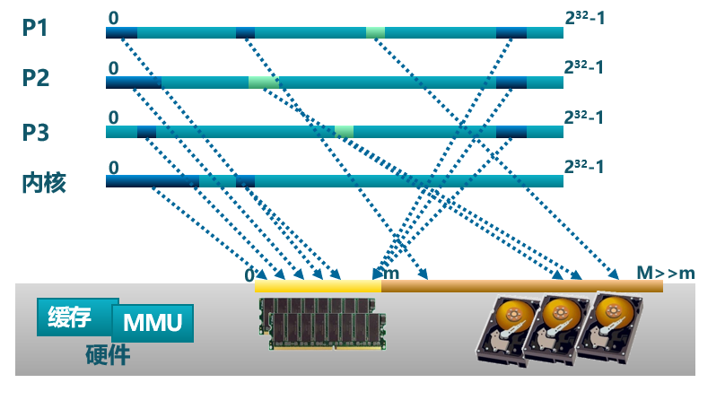
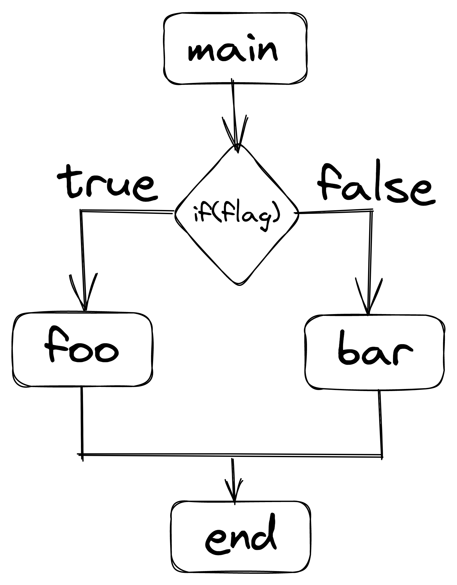
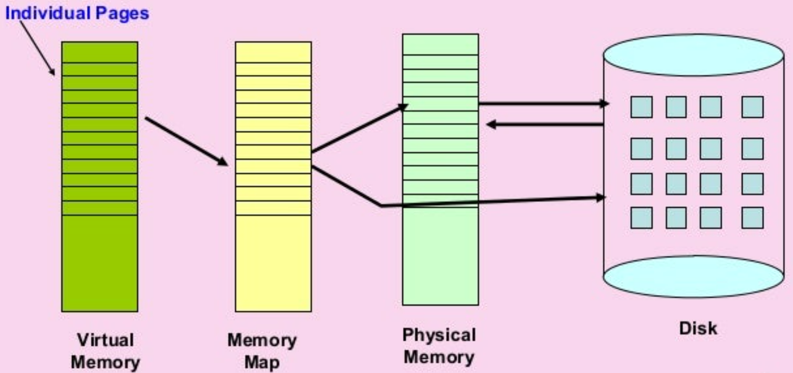

# 第六讲 虚拟存储管理
## 第一节 虚拟存储概念

 
 
 
 

向勇 陈渝 李国良 任炬 

2023年秋季

---

**提纲**

### 1. 虚拟存储技术的需求
2. 覆盖技术
3. 交换技术
4. 虚拟存储的基本概念
5. 缺页异常

---

#### 虚拟存储技术的需求背景

程序规模的增长速度**远大于**存储器容量的增长速度

理想中的存储器: **容量**更大、**速度**更快、**价格**更便宜的**非易失性**存储器  

---
#### 虚拟存储的基本思路
**挑战**：计算机系统时常出现**内存不够用**
**思路**：内存不够，外存来补
- 函数覆盖（overlay）
  - 应用程序以**函数/模块**为单位**手动**换入换出内存
- 程序交换（swapping）
  - 操作系统以**程序**为单位**自动**换入换出内存
- 虚拟存储(virtual storage)
  - 操作系统以**页**为单位**自动**换入换出内存

虚拟存储=内存+外存

---
#### 地址空间
<!--
计算机系统时常出现内存空间不够用
- 模块覆盖（overlay）
  - 应用程序**手动**把需要的指令和数据保存在内存中
- 任务交换（swapping）
  - 操作系统**自动**把暂时不能执行的程序保存到外存中
- 虚拟存储
  - 在有限容量的内存中，以**页为单位自动**装入更多更大的程序
--->
地址空间是操作系统对虚拟存储的**抽象**。

---

**提纲**

1. 虚拟存储技术的需求
### 2. 覆盖技术
3. 交换技术
4. 虚拟存储的基本概念
5. 缺页异常

---

#### 覆盖技术
- 目标
  - 程序员**手动**控制在**较小的可用内存**中运行**较大的程序**
- 基本思路
  - **不同时间段**内执行的**函数或模块**共享一块有限的空间

---

#### 覆盖的基本原理

  覆盖是指把一个程序**划分**为一系列功能相对独立的程序段，让执行时**不要求同时装入**内存的程序段组成一组（称为覆盖段），**共享**主存的同一个区域。
  - **必要**部分（常用）的代码和数据常驻内存
  - **可选**部分（不常用）放在其他程序模块中,只在**需要时装入**内存
  - **不存在调用关系**的模块可相互覆盖，共用同一块内存区域

---

#### 覆盖技术示例

---

#### 覆盖技术的不足

- 增加**编程困难**
  - 需程序员划分功能模块，并确定模块间的覆盖关系
  - 增加了编程的复杂度；
- 增加**执行时间**
  - 从外存装入覆盖模块
  - 时间换空间

[Turbo Pascal](https://winworldpc.com/product/turbo-pascal/7x)的Overlay系统单元支持程序员控制的覆盖技术

---

**提纲**

1. 虚拟存储技术的需求
2. 覆盖技术
### 3. 交换技术
4. 虚拟存储的基本概念
5. 缺页异常

---

#### 交换技术 
- 基本思路
  - 操作系统以**程序**为单位**自动**换入换出内存
- 方法
  - **换出(swap out)**：把一个执行程序的整个地址空间内容保存到外存
  - **换入(swap in)**：将外存中某执行程序的地址空间内容读入到内存

---

#### 交换技术面临的问题

- 交换**时机**：何时需要发生交换？
  - 只当内存空间不够或有不够的可能时换出
- 程序换入时的**重定位**：换出后再换入时要放在原处吗？
  - 不一定在原处，需要某种机制保证程序正确寻址&执行 

---

#### 交换技术面临的问题

- 交换区（空间）**大小**：经验值。下面是Linux专家给出的建议

<!-- redhat的建议 https://access.redhat.com/documentation/en-us/red_hat_enterprise_linux/6/html/installation_guide/s2-diskpartrecommend-ppc#id4394007 -->

---

#### 覆盖与交换的比较
- 程序覆盖
  - 发生在某时间段不在一个控制流上的**模块/函数间**
  - 以模块/函数为单位
  - 程序员须给出模块/函数间的**逻辑覆盖结构**
- 交换
  - 发生在运行的**程序间**
  - 以运行的程序为单位
  - 不需要模块间的逻辑覆盖结构

运行的程序：``任务``或``进程``
 
---

**提纲**

1. 虚拟存储技术的需求
2. 覆盖技术
3. 交换技术
### 4. 虚拟存储的基本概念
5. 缺页异常

---

#### 虚拟存储的定义
- 定义
  - 虚拟存储 = **内存** + **外存**
- 思路
  - 操作系统将**不常用**的部分内存**暂存**到外存，将要处理器访问的数据从外存**装入**内存
- **前提**
  - 程序具有**局部性**

 ---

#### 局部性原理

局部性（locality）：程序在执行过程中的一个**较短时期**，所执行的**指令**地址和指令的**操作数**地址，分别局限于**一定区域**
- **时间**局部性：一条**指令**的一次执行和下次执行，一个**数据**的一次访问和下次访问都集中在一个**较短时期**内
- **空间**局部性：当前指令和邻近时间的几条**指令**，当前访问的数据和邻近时间访问的几个**数据**都集中在一个**较小区域**内
- **分支**局部性：一条**跳转指令**的两次执行，很可能**跳到相同的内存位置**

局部性的意义：如果大部分程序运行具有局部性特征，则虚拟存储技术是能够实现的，而且可取得满意的效果

---

#### 虚拟存储的思路与规则
- 思路：将**不常用**的部分内存块暂存到外存
- 规则：
  - **装载**程序时：只将**当前指令执行需要的**部分页面或段装入内存
  - 指令执行中需要的指令或数据**不在内存**（称为缺页或缺段）时：处理器通知操作系统将相应的页面或段调入内存
  - 操作系统将内存中**暂时不用**的页面或段保存到外存
- 实现方式：
  - 虚拟页式存储
  - 虚拟段式存储

---

#### 虚拟存储的基本特征
- 不连续性
  - 物理内存分配非连续
  - 虚拟地址空间使用非连续
- 大用户空间
  - 提供给用户的虚拟内存可大于实际的物理内存
- 部分交换
  - 虚拟存储只对部分虚拟地址空间进行调入和调出

---
#### 虚拟存储的底层支撑
- 硬件(MMU/TLB/PageTable)
  - 页式或段式存储中的硬件**地址转换**机制、硬件**异常**
- 软件(OS)
  - 内存中建立**页表或段表**
  - 管理内存和外存间页面或段的**换入和换出**

---

#### 虚拟页式存储管理
在页式存储管理的基础上，增加请求调页和页面置换

- **基本思路**
  - 当用户程序要装载到内存时，只**装入部分**页面，就启动程序运行
  - 用户程序在运行中发现有需要的代码或数据不在内存时，则向系统发出**缺页异常**请求
  - 操作系统在处理缺页异常时，将外存中相应的页面**调入**内存，使得用户程序能继续运行
  - 当内存快用完时，操作系统把部分页从内存**调出**到外存

---

#### 虚拟页式存储管理
在页式存储管理的基础上，增加请求调页和页面置换
- 请求调页：也称按需分页，在处理器需要访问某数据时，才把数据从外存调入内存
- 页面置换：把不常用页换出，要使用的页换入
- 缺页异常处理：**软硬件协同支持**
 

---

**提纲**

1. 虚拟存储技术的需求
2. 覆盖技术
3. 交换技术
4. 虚拟存储的基本概念
### 5. 缺页异常

---

#### 缺页异常的处理流程
1. CPU读内存单元，在TLB中根据其虚拟地址匹配物理地址，未命中，**读页表**；
1. 由于页表项的存在位为0，CPU产生**缺页异常**；
1. OS**查找**到保存在外存中对应的应用的页面内容；

---

#### 缺页异常的处理流程

4-1. 如有空闲物理页帧，把外存中的页面内容**换入到某空闲物理页帧**中；
4-2. 如无空闲物理页帧，通过置换算法**释放/换出**某物理页帧到外存，再把外存中的页面内容换入到某空闲物理页帧中；

---

#### 缺页异常的处理流程

5. **修改页表项**，建立虚拟页到物理页帧的映射，存在位置1；
6. OS返回到应用程序，让处理器**重新执行**产生缺页异常的读内存单元指令。

*在何处保存未被映射的页？如何找到这个页？*

---

#### 在何处保存未被映射的页？
  - 交换空间（磁盘/文件形态）
    - 采用特殊格式存储未被映射的页面
  - 磁盘上的文件(代码或数据)

---

#### 虚拟存储的外存交换空间

在何处保存放在外存中的页的地址？

- 交换空间
    - 磁盘分区：一般是扇区地址
    - 在存在位为0的页表项中保存外存的页地址

---

#### 虚拟存储的外存磁盘文件

在何处保存放在外存中的页的地址？

- 磁盘上的文件(代码或数据)
  - 地址空间中的逻辑段表示中有对应的文件位置
    - 如：`MemorySet::MapArea`
  - 代码段：可执行二进制文件
  - 动态加载的共享库程序段：动态调用的库文件

---

#### 虚拟存储的性能

有效存储访问时间（EAT, Effective memory Access Time）
- EAT = 内存访问时间 $*$ (1-p)  + 缺页异常处理时间 
- 缺页异常处理时间 = 磁盘访问时间*p(1+q)
  - p: 缺页率；
  - q: 写回概率
* 例子
  - 内存访问时间: 10 ns ；磁盘访问时间: 5 ms
  - EAT = 10(1–p) + 5,000,000p(1+q) 

---

### 小结

1. 虚拟存储技术的需求
2. 覆盖技术
3. 交换技术
4. 虚拟存储的基本概念
5. 缺页异常
