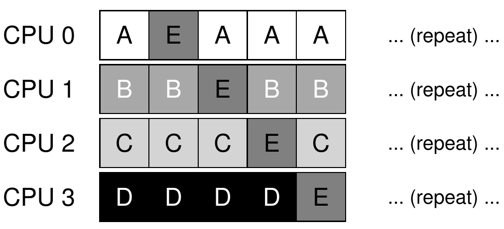

# 第八讲 多处理器调度
## 第二节 多处理器调度概述

 
 

向勇 陈渝 李国良 任炬 

2023年秋季

---

**提纲**

### 1. 单队列多处理器调度SQMS
2. 多队列多处理器调度MQMS

---

#### 单队列多处理器调度
Single Queue Multiprocessor Scheduling, SQMS
- 复用单处理器调度下的基本架构
- 所有需要调度的进程放入**一个队列**中
 

---

#### 单队列多处理器调度的特征
- 缺乏可扩展性 (scalability)
- 缓存亲和性 (cache affinity) 弱
 

---

#### 多处理器调度的亲和度与负载均衡
尽可能让进程在同一个 CPU 上运行。保持一些进程的亲和度的同时，可能需要牺牲其他进程的亲和度来实现负载均衡。
 

---

**提纲**

1. 单队列多处理器调度SQMS
### 2. 多队列多处理器调度MQMS

---

#### 多队列多处理器调度
Multi-Queue MultiprocessorScheduling, MQMS
- 基本调度框架包含**多个调度队列**，每个队列可用不同的调度规则。
- 依照一些启发性规则，在进程进入系统时，将其放入某个调度队列。
- **每个 CPU 调度相互独立**，避免单队列方式的数据共享及同步问题。
 
 

---

#### 多队列多处理器调度的特征
- 具有**可扩展性**：队列的数量会随着CPU 的增加而增加，因此锁和缓存争用的开销不是大问题。
- 具有良好的**缓存亲和度**：所有进程都保持在固定的 CPU 上，因而可以很好地利用缓存数据。
 
 

---

#### 多队列多处理器调度的负载不均
-  假定4个进程，2个CPU；队列都执行轮转调度策略；进程C执行完毕
-  A 获得了 B 和 D 两倍的 CPU 时间

 
 

---

#### 如何解决MQMS的负载不均？

- 假定 4 个进程，2 个 CPU；每个队列都执行轮转调度策略；A 和 C 都执行完毕，系统中只有 B 和 D
  - CPU1 很忙
  - CPU0 空闲

 
 

---

#### 进程迁移 (migration)
- 通过进程的跨 CPU 迁移，可实现负载均衡。
  - 情况：CPU0 空闲，CPU1 有一些进程。
  - 迁移：将 B 或 D 迁移到 CPU0

 
 

---

#### MQMS如何确定进程迁移时机?

- 情况：A 独自留在 CPU 0 上，B 和 D 在 CPU 1 上交替运行
- 迁移：**不断地迁移和切换**一个或多个进程

 
 

---

#### MQMS的工作窃取 (work stealing)
- 进程量较少的 (源) 队列不定期地“偷看”其他 (目标) 队列是不是比自己的进程多
- 如果目标队列比源队列 (显著地) 更满，就从目标队列“窃取”一个或多个进程，实现负载均衡。

 
 

---

#### 工作窃取的队列检查间隔
- 如果频繁地检查其他队列，就会带来较高的开销，可扩展性不好
- 如果检查间隔太长，又可能会带来严重的负载不均
 
 